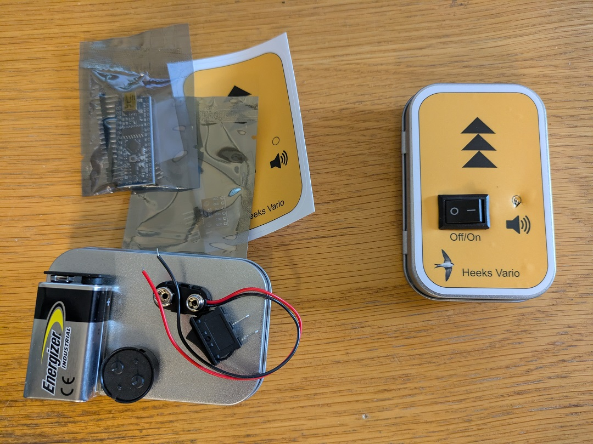

# vario
  
paragliding vario with arduino nano, piezo sounder, bmp280 altimeter, 9V battery  
https://www.youtube.com/watch?v=9QVq33m_nv8

Instructions here https://github.com/danheeks/vario/tree/master/bmp280piezo  
One battery lasted me two summers of amateur paragliding, maybe 50hrs, including a flight of 202km in the UK!  
https://youtu.be/KGif6ZkmjKs?t=256  

You can buy a kit to make your own for £10, doesn't include postage

It includes:  
  
Tin  
Arduino Nano  
BMP280 sensor  
Piezo Buzzer ( passive not active )  
9V PP3 battery  
battery connector and wires  
On/Off switch  
version 7 PCB ( currently waiting for an order, available around 20th June 2026 )  
Sticker for front of tin  
  
Or you can buy a working vario £20, doesnt' include postage, ( I have 2 in stock 6th June 2026 ).  
  
Email danheeks@gmail.com for enquiries and to check on stock  
  

