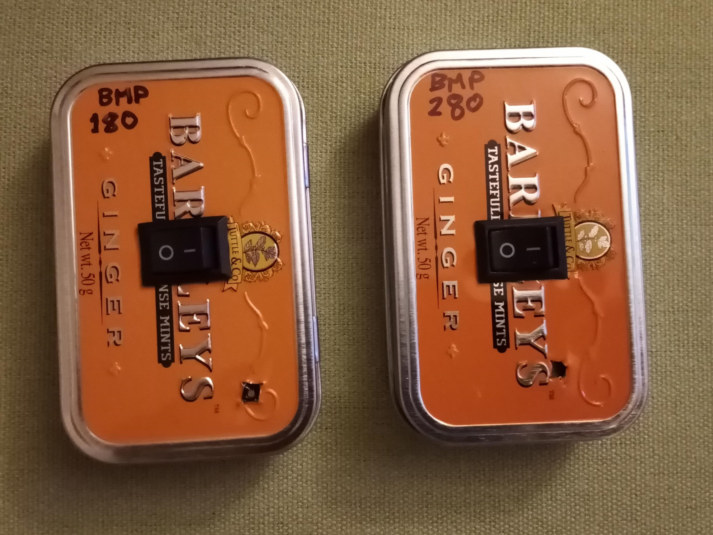

# vario
  
paragliding vario with arduino nano, piezo sounder, bmp180 altimeter, 4x Nimh batteries  
old video:  
https://youtu.be/r1CVEgGCK1Q  
  
I made one using the MS5611 module, which is more expensive, but I read that it is less affected by RF noise.  
  
new video:  
https://youtu.be/hXAc20TRS4Y  
  
I made one with BMP180 with ideas from here  
https://www.youtube.com/watch?v=dkzky-Mxypo  
putting it in a metal tin seems to cut out the RF interference.  
  
I made one with BMP280. This works so well that I can leave the sensor to do the averaging and let the arduino sleep in between.  
The reponse time is quicker than the one with the BMP180.
Instructions here https://github.com/danheeks/vario/tree/master/bmp280piezo
One battery lasted me two summers of amateur paragliding including a flight of 202km in the UK!
https://youtu.be/KGif6ZkmjKs?t=256
  

