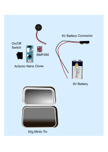

Vario using BMP280

Wiring
- (GND) to GND
+ (VDD) to 3.3V
SCL to A5
SDA to A4
D9 and D10 to the Piezo Buzzer ( see toneAC.h )

I measured 10mA standby current, so should theoretically last 55 hours.

