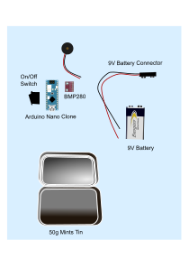

Vario using BMP280

Items needed

- Tin
- Arduino Nano
- BMP280 sensor
- Piezo Buzzer ( passive not active )
- 9V PP3 battery
- On/Off switch
- some wire

Wiring.

- Arduino GND to BMP280 GND
- Arduino 3.3V to BMP280 VDD
- Arduino A5 to BMP280 SCL
- Arduino A4 to BMP280 SDA
- Arduino D9 and D10 to the Piezo Buzzer ( see toneAC.h )
- Arduino VIN to battery + ( via on/off switch )
- Arduino GND to battery -

I measured 10mA standby current, so should theoretically last 55 hours.
One battery lasted me two summers of amateur paragliding, maybe 50hrs, including a flight of 202km in the UK!  
https://youtu.be/KGif6ZkmjKs?t=256  

Video of how to make this vario  
https://youtu.be/9QVq33m_nv8

